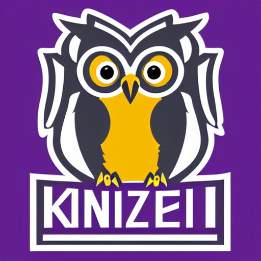

# Exploring Stable diffusion with Intel OpenVINO to mock up new Kenyon Logo ideas

Recently, a new sports logo was announced for the Kenyon College. The former Kenyon Lords and Ladies have been rebranded as the Kenyon Owls.

Here are examples of prompts and resulting logos based upon text2img diffusion models on [lexica.art](https://lexica.art/?q=sports+logos).

This repo contains a few unfiltered examples of new logos based upon variations of the prompt:

"minimalist logo of a nerdy owl perched on a shield, purple and white colors, sharp, accented, detailed, flat colors, professional, kenyon college"

